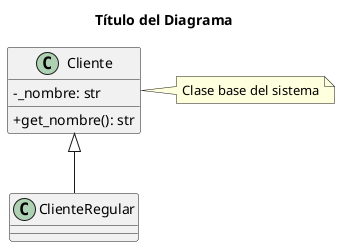

# Entregable 3: Diagramas de Clase con PlantUML

**Estudiante:** Daniela Muñoz Vásquez
**Proyecto:** Gestor Inteligente de Clientes (GIC)  
**Empresa:** SolutionTech  
**Fecha:** Febrero 2026

---

## 1. ¿Qué es PlantUML?

**PlantUML** es una herramienta de código abierto que permite crear diagramas UML a partir de un lenguaje de texto simple. Utiliza la notación estándar UML (Unified Modeling Language) para generar diagramas de manera automática y reproducible.

### 1.1 Propósito de PlantUML

- **Visualización:** Genera diagramas UML de manera automática desde texto
- **Especificación:** Define la estructura y comportamiento del sistema en código
- **Construcción:** Guía la implementación mediante diagramas claros
- **Documentación:** Sirve como referencia versionable para el equipo

### 1.2 Ventajas de PlantUML

**Beneficios principales:**
- Sintaxis basada en texto, fácil de aprender
- Puede versionarse con Git junto al código fuente
- Genera múltiples formatos (PNG, SVG, PDF)
- Integración con editores e IDEs
- Diagramas consistentes y estandarizados
- Actualización rápida sin necesidad de herramientas gráficas

**Tipos de diagramas soportados:**
- Diagrama de Clases (el que usaremos)
- Diagrama de Casos de Uso
- Diagrama de Secuencia
- Diagrama de Actividades
- Diagrama de Estados
- Diagrama de Componentes

## 2. Diagrama de Clases en PlantUML

El **Diagrama de Clases** muestra la estructura estática del sistema mediante clases, atributos, métodos y relaciones.

### 2.1 Sintaxis Básica de una Clase

En PlantUML, una clase se define con la palabra clave `class`:

```plantuml
class NombreClase {
    - atributo1: tipo
    - atributo2: tipo
    --
    + metodo1(): tipo
    + metodo2(): tipo
}
```

**Elementos:**
- `class` declara la clase
- Los atributos se listan primero
- `--` separa atributos de métodos
- Los métodos se listan después

### 2.2 Visibilidad de Atributos y Métodos

Los símbolos indican el nivel de acceso:

- `+` **Público:** Accesible desde cualquier parte
- `-` **Privado:** Solo accesible dentro de la clase
- `#` **Protegido:** Accesible en la clase y sus subclases
- `~` **Paquete:** Accesible dentro del mismo paquete

**Ejemplo en PlantUML:**
```plantuml
class Cliente {
    - _nombre: str
    - _email: str
    + get_nombre(): str
    + set_email(email: str)
}
```

### 2.3 Tipos de Datos

Los atributos y métodos especifican su tipo después de dos puntos:

```plantuml
- nombre: str
- edad: int
- activo: bool
+ calcular_descuento(): float
```

## 3. Relaciones entre Clases en PlantUML

Las relaciones definen cómo las clases interactúan entre sí.

### 3.1 Herencia (Generalización)

Representa una relación "es un" donde una clase hija hereda de una clase padre.

**Sintaxis PlantUML:** `<|--`

```plantuml
Cliente <|-- ClienteRegular
Cliente <|-- ClientePremium
Cliente <|-- ClienteCorporativo
```

**Características:**
- La subclase hereda todos los atributos y métodos del padre
- Permite especialización y reutilización de código
- La flecha apunta de la clase hija hacia la clase padre

**Ejemplo en el GIC:**
- `ClienteRegular` es un `Cliente`
- `ClientePremium` es un `Cliente`
- `ClienteCorporativo` es un `Cliente`

### 3.2 Composición

Representa una relación "contiene" donde una clase es parte fundamental de otra. Si el todo se destruye, las partes también.

**Sintaxis PlantUML:** `*--`

```plantuml
Pedido *-- LineaPedido
```

**Características:**
- Relación fuerte de pertenencia
- Las partes no existen sin el todo
- Rombo negro indica la propiedad

**Ejemplo:**
- Un `Pedido` tiene `LineaPedido`
- Si se elimina el pedido, las líneas también se eliminan

### 3.3 Agregación

Representa una relación "tiene un" donde una clase contiene a otra, pero pueden existir independientemente.

**Sintaxis PlantUML:** `o--`

```plantuml
Empresa o-- Empleado
```

**Características:**
- Relación débil de pertenencia
- Las partes pueden existir sin el todo
- Rombo blanco indica la asociación

**Ejemplo:**
- Una `Empresa` tiene `Empleados`
- Si se cierra la empresa, los empleados siguen existiendo

### 3.4 Asociación

Representa una relación general entre clases.

**Sintaxis PlantUML:** `--`

```plantuml
Cliente "1" -- "0..*" Pedido
```

**Multiplicidad:**
Se indica cuántos objetos participan en la relación:

- `1` : Exactamente uno
- `0..1` : Cero o uno
- `*` : Cero o más
- `1..*` : Uno o más
- `n..m` : Entre n y m

### 3.5 Dependencia

Indica que una clase usa a otra temporalmente.

**Sintaxis PlantUML:** `..>`

```plantuml
Cliente ..> validaciones_simple : <<usa>>
```

**Características:**
- Relación temporal
- Una clase depende de otra para funcionar
- Cambios en una clase pueden afectar a la otra

## 4. Diagrama del Sistema GIC

### 4.1 Estructura de Clases

El sistema GIC tiene la siguiente jerarquía:

**Clase Base:**
- `Cliente`: Clase principal con atributos y métodos comunes

**Clases Derivadas:**
- `ClienteRegular`: Cliente estándar sin beneficios especiales
- `ClientePremium`: Cliente con descuentos y beneficios
- `ClienteCorporativo`: Cliente empresarial con condiciones especiales

**Clases de Soporte:**
- `validaciones_simple`: Funciones para validar datos
- `GestorClientes`: Gestiona la colección de clientes
- `SistemaLogs`: Registra eventos del sistema
- `PersistenciaJSON`: Guarda y carga datos

### 4.2 Atributos por Clase

**Cliente (clase base):**
```
- _nombre: str
- _email: str
- _telefono: str
- _direccion: str
```

**ClienteRegular:**
```
- _fecha_registro: date
```

**ClientePremium:**
```
- _nivel_membresia: str
- _descuento: float
- _puntos_acumulados: int
```

**ClienteCorporativo:**
```
- _nombre_empresa: str
- _rut_empresa: str
- _contacto_principal: str
- _limite_credito: float
- _credito_utilizado: float
```

### 4.3 Métodos por Clase

**Cliente:**
```
+ __init__(nombre, email, telefono, direccion)
+ get_nombre(): str
+ get_email(): str
+ get_telefono(): str
+ get_direccion(): str
+ set_nombre(nombre: str)
+ set_email(email: str)
+ set_telefono(telefono: str)
+ set_direccion(direccion: str)
+ mostrar_informacion()
+ obtener_resumen(): dict
```

**ClientePremium:**
```
+ get_nivel_membresia(): str
+ get_descuento(): float
+ get_puntos_acumulados(): int
+ agregar_puntos(puntos: int)
+ canjear_puntos(puntos: int): bool
+ calcular_descuento(monto: float): float
```

**ClienteCorporativo:**
```
+ get_nombre_empresa(): str
+ get_credito_disponible(): float
+ verificar_credito_disponible(monto: float): bool
+ utilizar_credito(monto: float): bool
+ pagar_credito(monto: float)
+ calcular_descuento(monto: float): float
```

### 4.4 Relaciones en el GIC

1. **Herencia:**
   ```plantuml
   Cliente <|-- ClienteRegular
   Cliente <|-- ClientePremium
   Cliente <|-- ClienteCorporativo
   ```

2. **Composición:**
   ```plantuml
   GestorClientes *-- Cliente
   ```
   - Si el gestor se destruye, la colección también

3. **Dependencia:**
   ```plantuml
   Cliente ..> validaciones_simple : <<usa>>
   ```
   - Todas las clases de cliente dependen de validaciones

## 5. Beneficios de PlantUML

### 5.1 Para el Desarrollo

- **Planificación:** Permite diseñar antes de programar
- **Comunicación:** Facilita el entendimiento entre el equipo
- **Documentación:** Sirve como referencia permanente
- **Versionamiento:** Se integra con Git como código fuente

### 5.2 Para el Mantenimiento

- **Claridad:** Muestra la estructura completa del sistema
- **Modificaciones:** Ayuda a identificar impactos de cambios
- **Escalabilidad:** Facilita agregar nuevas funcionalidades
- **Actualización:** Rápida modificación del diagrama editando texto

### 5.3 Para Nuevos Desarrolladores

- **Comprensión rápida:** Entienden el sistema visualmente
- **Onboarding:** Reducen el tiempo de adaptación
- **Referencia:** Consultan el diagrama cuando tienen dudas

## 6. Buenas Prácticas con PlantUML

### 6.1 Al Diseñar Diagramas

1. **Simplicidad:** No incluir todo en un solo diagrama
2. **Claridad:** Nombres descriptivos y concisos
3. **Consistencia:** Usar convenciones estándar de UML
4. **Actualización:** Mantener sincronizado con el código
5. **Comentarios:** Usar `'` para comentarios en el archivo .puml

### 6.2 Al Implementar

1. **Seguir el diseño:** El código debe reflejar el diagrama
2. **Documentar cambios:** Actualizar el .puml cuando se modifica el código
3. **Validar relaciones:** Verificar que las relaciones sean correctas
4. **Versionar:** Incluir archivos .puml en el control de versiones

## 7. Uso de PlantUML

### 7.1 Herramientas y Editores

**Editores con soporte PlantUML:**
- **VS Code:** Extensión "PlantUML"
- **IntelliJ IDEA / PyCharm:** Soporte nativo
- **Atom:** Paquete "plantuml-viewer"
- **Sublime Text:** Paquete "PlantUML"

**Visualización online:**
- PlantUML Online Server: https://www.plantuml.com/plantuml/uml/
- PlantText: https://www.planttext.com/

### 7.2 Generación de Imágenes

PlantUML puede generar varios formatos:

```bash
# Generar PNG
plantuml diagrama_clases.puml

# Generar SVG
plantuml -tsvg diagrama_clases.puml

# Generar PDF
plantuml -tpdf diagrama_clases.puml
```

### 7.3 Sintaxis Básica del Archivo .puml

Estructura típica de un archivo PlantUML:



## 8. Lectura del Diagrama GIC

Para entender el diagrama PlantUML del GIC:

1. **Identificar la jerarquía:** Cliente es la clase base
2. **Observar herencias:** Las tres subclases heredan de Cliente (`<|--`)
3. **Revisar atributos:** Cada clase tiene sus propios atributos privados (`-`)
4. **Analizar métodos:** Métodos comunes en la base, específicos en subclases
5. **Entender relaciones:** Composición con GestorClientes (`*--`), dependencia con validaciones (`..>`)

## 9. Conclusión

PlantUML es una herramienta fundamental para diseñar y documentar sistemas orientados a objetos de manera reproducible y versionable. Para el proyecto GIC, el diagrama PlantUML muestra claramente la estructura de herencia que permite reutilizar código mientras se especializan comportamientos para diferentes tipos de clientes.

Este diseño basado en texto facilita la implementación del código, el mantenimiento del sistema, la comprensión por parte de todo el equipo de desarrollo, y permite mantener la documentación sincronizada con el código fuente.

---

## 10. Referencias

- PlantUML Official Documentation: https://plantuml.com/
- PlantUML Class Diagram: https://plantuml.com/class-diagram
- OMG UML Specification: https://www.omg.org/spec/UML/
- Diagrama PlantUML del GIC: `diagrama_clases.puml`
